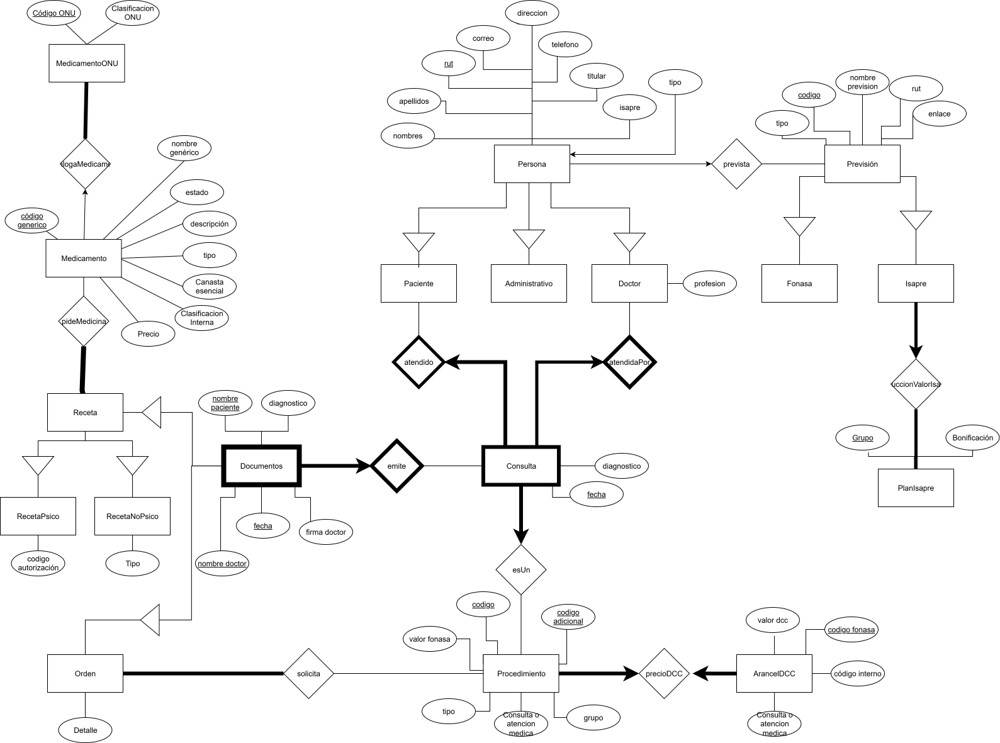

# Informe Entrega 1 - Bases de datos IIC2413

### Datos del Alumno
| **Apellidos**       | **Nombres**          | **Número de Alumno** |
|---------------------|----------------------|----------------------|
| Jara García         | Fernando Martín      | 2420286J             |

### 1. Modelo Entidad-Relación (E/R)
<!-- Inserta aquí tu diagrama ER. Usa el formato svg para evitar la perdida de calidad. Reemplaza "diagrama.svg" por la ruta a tu archivo -->

### 2. Entidades Débiles
#### 2.1 Consulta

- Se identifico **Consulta** como entidad débil porque para identificar una consulta específica, es necesario usar la llave del **doctor** que la realiza (rut del doctor) y la llave del **paciente** quien es atendido en la consulta (rut paciente). De esta forma, el modelo captura la dependencia que tiene una consulta de el doctor y el paciente. Sin embargo, un doctor puede antender múltiples veces a un paciente, por lo que se define fecha como llave débil.

#### 2.2 Documentos
- Se identifico **Documentos** como entidad débil porque para acceder a un documento, es necesario conocer la información de la consulta en la que fue realizada (fecha). Asimismo, para conocer la consulta en sí es necesario observar el doctor que la realizó y el paciente (rut de paciente y doctor).

### 3. Llaves Primarias  y Compuestas
<!-- Justifica TODAS las llaves: primaria simple y primaria compuesta -->
#### 3.1 Persona (y por ende Paciente, Administrativo y Doctor)
La llave primaria de __Persona__ es  __RUT__ porque toda persona, sin excepciones, puede ser identificada por un RUT único. Dado que es único y de fácil acceso, rut es su llave primaria.

#### 3.2 Previsión (y por ende Isapre y Fonasa)
La llave primaria de __Previsión__ es __código__, pues este es único según cada previsión. Esté código se ha escogido sobre el rut de la previsión, pues es quien aparece en la información de cada persona.

#### 3.3 PlanIsapre
La llave primaria de __PlanIsapre__ es __Grupo__, pues cada grupo permite identificar una única bonificación. 

#### 3.4 ArancelDCC
La llave primaria de __ArancelDCC__ es __código fonasa__. Pese a ser contraintuitivo, código interno NO es una llave válida, pues con algunos codigos internos se pueden identificar 2 o más tuplas distintas. Sin embargo, esto no ocurre con código fonasa. 

Esta elección mantiene mayor claridad, pues es una llave común con Procedimiento, al menos al unir dos atributos de Procedimiento.

#### 3.5 Procedimiento (ArancelFonasa)
La llave compuesta de  __Procedimiento__ es (__codigo__, __codigo adicional__). De los archivos propuestos, se puede identificar que código por si solo no es una llave, pues existen varios códigos que retornan 2 o más instancias. Asimismo, código adicional tiene el mismo problema. No obstante, el uso conjunto de ambos permite identificar una única tupla. De esta forma se toma como llave. 

Además, esta elección es consistente con la llave de ArancelDCC y es la más flexible al eventual ingreso de nuevas tuplas a Procedimiento.

#### 3.6 Medicamento
La llave primaria de __Medicamento__ es __código generico__. Esta ha sido seleccionada como llave primaria, pues en los archivos se puede apreciar que cada medicamento tiene un único (y diferente) código genérico. De esta forma, si conocemos un código genérico, sabemos a que UNICO medicamento esta asignado y de esta forma podemos concoer todos sus parametros.

En otras palabras, todo medicamento tiene un código genérico y todo código genérico tiene un único medicamento asignado.

Además, esta llave es amigable a la inserción de nuevos medicamentos a Medicamento.

#### 3.7 MedicamentoONU
La llave primaria de __MedicamentoONU__ es __código ONU__. Esta ha sido seleccionada como llave primaria, pues en los archivos se puede apreciar que cada medicamentoONU tiene un único (y diferente) código genérico. De esta forma, si conocemos un códigoONU, sabemos a que UNICO medicamento esta asignado y de esta forma podemos concoer todos sus parametros.

En otras palabras, todo medicamentoONU tiene un códigoONU y todo códigoONU tiene un único medicamentoONU asignado.

Además, esta llave es amigable a la inserción de nuevos medicamentos a MedicamentoONU.
<!--            Revisar              -->
#### 3.8 Consulta
Consutla, al ser una entidad débil, tiene la llave débil __fecha__ que le permite identificar cuando ocurre una consulta, pues se asume que no tiene sentido que un paciente tenga dos consultas el mismo día con el mismo doctor. Además, al ser entidad débil, necesita de la llave foranea __(Paciente.rut, Doctor.rut)__ para acceder a dicha consulta.

#### 3.9 Documentos (y por ende Receta, RecetaPsico, RecetaNoPsico y Orden)
Los documentos son una entidad débil, por esto poseen una llave débil compuesta: __(nombre paciente, nombre doctor)__ y una llave foranea que corresponden la las llaves de Consulta. De los documentos se puede apreciar que para acceder a un documento, es necesario conocer el nombre y rut tanto del doctor como del paciente, además de la fecha en la que este es emitido. Por último, también se necesita saber que tipo de documento es (receta u orden), pero esta última problemática se aborda a través de la jerarquía.
<!--            Revisar              -->

### 4. Relaciones
<!-- Justifica TODAS las relaciones de tu modelo -->
#### 4.1 prevista
Relaciona  __Persona__ y __Previsión__, porque cada presona tiene a lo más una previsión que le permite acceder a diferentes cobros/bonificaciones tanto de consultas como ordenes/procedimientos.

#### 4.2 reduccionValorIsapre
Relaciona __Isapre__ y __PlanIsapre__. Con esta relación, se incorpora al mdoelo que cada isapre tienen un plan asociado, que enterga una bonificación para cada grupo de prestaciones.

#### 4.3 atendidaPor
Relaciona __Doctor__ y __Consulta__. De esta forma, se establece a través de la entidad auxiliar __Consulta__ que cada consulta tiene un único __Doctor__ que la reliza. 

#### 4.4 atendido
Relaciona __Paciente__ y __Consulta__, pues cada consulta tiene un único paciente que la recibe.

#### 4.5 esUn
Relaciona __Consulta__ y __Procedimiento__, dado que cada consulta es un procedimiento en términos de ArancelFonasa o ArancelDCC. Esto permite que el valor de una consulta sea determinado en función del procedimiento que es y si el paciente es Fonasa o Isapre.

#### 4.6 precioDCC
Relaciona __Procedimiento__ y __ArancelDCC__. De esta forma cada __Procedimiento__ (que es arancelFonasa) tiene una versión homologa en ArancelDCC que permite identificar el precio real de cada procedimiento según la previsión del paciente.

#### 4.7 solicita
Relaciona __Orden__ y __Procedimiento__. Según la descripción de 'Orden', cada una pide al menos un procedimiento/examen que esta contenido en la entidad __Procedimiento__.

#### 4.8 pideMedicina
Relaciona __Receta__ y __Medicamento__. Cada __Receta__ pide un conjunto de __Medicamento__ presente en Maestro farmacia.

#### 4.9 homolgaMedicamento
Relaciona __Medicamento__ y __MedicamentoONU__. Permite relacionar cada __Medicamento__ con su clasificación ONU y código ONU, si es que existe. Separar medicamento en dos entidades y relacionarlas permite conseguir el BCNF en estas dos entidades.

#### 4.10 emite
Relaciona __Documentos__ con __Consulta__
Cada __Documento__ es emitido en alguna __Consulta__. De hecho, ambas instancias comparten distintos atributos, no obstante, un documento posee distintas relaciones o atributos según que tipo de documento sea.

### 5. Cardinalidades
<!-- Explica la cardinalidad en CADA relación del modelo -->
#### 5.1 Persona - Previsión (n a (0 -- 1))
- Una instancia de **Persona** puede estar asociada con cero o una instancia de  **Previsión**, es decir, una persona puede no tener previsión o tener a lo más una (sea isapre o fonasa).
- Por otro lado, cada instancia de **Prevision** se relaciona con un número n de **Personas**. De esta forma, una isapre puede tener múltiples personas inscritas (n).

#### 5.2 Isapre - PlanIsapre ((1 a n) a 1)
- Una instancia de **Isapre** está asociada con una única instancia de **PlanIsapre**, es decir, cada isapre tiene un único plan de descuento.
- Por otro lado, cada instancia de **PlanIsapre** tiene al menos una isapre a la que esta asociada. Sin embargo, un plan isapre puede tener más de una isapre asociada, en caso de que los beneficios ofrecidos entre ellas sean idénticos. 

#### 5.3 Procedimiento - ArancelDCC (1 a 1)
- Una instancia de **Procedimiento** está asociada con una única instancia de **ArancelDCC**, es decir, cada procedimiento en su versión de Fonasa tiene una versión en el arancel DCC
- Por otro lado, cada instancia de **ArancelDCC** exactamente una instancia análoga dentro de **ArancelDCC**. De cierta forma esta es una biyección.

#### 5.4 Procedimiento - Orden ([1 a n] a n)
- Una instancia de **Procedimiento** puede estar asociada a un número arbitrario de **Orden**, es decir, cada procedimiento puede ser solicitado muchas (o pocas) veces en distintas ordenes.
- Por otro lado, cada instancia de **Orden** tiene de 1 a n instancias de **Procedimiento** asignados, de esta forma, cada orden puede pedir que se realice una cantidad arbitraria de procedimientos estrictamente mayor a 0.

#### 5.5 Medicamento - MedicamentoONU ([1 a n] a [0 a 1])
- Una instancia de **Medicamento** puede estar asociada (o no) a una instancia de **MedicamentoONU**, es decir, un medicamento puede tener a lo más un codigo/clasificación ONU (instancia de **MedicamentoONU**). De acuerdo a los documentos entregados, un medicamento podría tambien NO tener una instancia asociada en **MedicamentoONU** (por esto el 0 a 1).
- Por otro lado, cada instancia de **MedicamentoONU** puede tener desde una hasta múltiples instancias de **Medicamento** asociadas. Por ejemplo, existen multiples entidades de **Medicamento** asociadas a la isntancia (10191509, Insecticidas) de **MedicamentoONU**.

#### 5.6 Medicamento - Receta ([1 a n] a n)
- Una instancia de **Medicamento** puede estar asociada (o no) a una o más instancias de **Receta**, es decir, un medicamento puede ser pedido por una cantidad arbitraria de recetas distintas.
- Por otro lado, cada instancia de **Receta** desde un **Medicamento** asociado, hasta una cantidad arbitraria de medicamentos.

#### 5.7 Documentos - Consulta (n a 1)
- Una instancia de **Documentos** puede estar asociada a una única **Consulta**, es decir, cada documento tiene una única consulta en la que fue emitida.
- Por otro lado, cada instancia de **Colsuta** tiene un númeor arbitrario entre 0 y n de **Documentos** emitidos. Por ejemplo, se podría no emitir ningun documento o emitir varios.

#### 5.8 Paciente - Consulta (1 a n)
- Una instancia de **Paciente** puede ser atendido en un número arbitrario de **Consultas**, es decir, un paciente puede haber sido atenido en cero o un número arbitrario de consultas (se asume que hay pacientes registrados que no han sido atendidos, por esto se mantiene (n a 1) y no ([1 a n] a 1))
- Por otro lado, en cada **Consulta** se atiende un único **Paciente**.

#### 5.9 Doctor - Consulta (1 a n)
- Una instancia de **Consulta** tien un único **Doctor** asociado que atiende dicha consulta.
- Por otro lado, cada instancia de **Doctor** puede atender un número indeterminado de **Consultas**, inclusive 0. Se incluye el cero para evitar posibles anomalías donde se contraten doctores nuevos (tendrán 0 consultas atendidas).

#### 5.10 Procedimiento - Consulta (1 a n)
- Una instancia de **Consulta** tiene un único **Procedimiento** asociado. Esto quiere decir que si la consulta es a un dentista por limpieza, el **procedimiento asociado** será limpieza y todos sus detalles adicionales.
- Por otro lado, cada instancia de **Procedimiento** puede tener una cantidad arbitraria de consultas realizadas. Una limpieza se puede hacer en múltiples (o ninguna) **Consulta**.

### 6. Jerarquías
<!-- Identifica y justifica TODAS las jerarquías -->
#### 6.1 Persona -> Administrativo - Paciente - Doctor
Se modelo una jerarquía donde **Persona** es la entidad padre y **Administrativo**, **Paciente** y **Doctor** heredan de ella, porque al igual que en los ejemplos de clase/ayudantía, todas las personas poseen una gran cantidad de atributos en común (rut, telefono, nobmre, etc.). Sin embargo, las personas están divididas en tres clases que poseen relaciones o atributos adicionales especificos de cada clase (por ejemplo Doctor tiene el atributo profesiion y una relacion exclusvia). De esta forma, se puede reducir la redundancia de la información y simplificar el diagrama E/R.

Con este modelo, las subclaes no tienen cobertura total de las personas registradas, por esto en el esquema se registrará la superclase Persona como tabla. Además, hay solapamiento entre Paciente, Doctor y Administrativo, pues existe personal médico que tambien es paciente. De todas maneras, esto no representa un problema para el modelo, sino una consideración a futuro. Esta formulación permite incorporar la primera regla del negocio: 'Las personas pueden ser pacientes, trabajar en le centro médico O AMBOS'.

#### 6.2 Prevision -> Isapre - Fonasa
Se modelo una jerarquía donde **Prevision** es la entidad padre y **Isapre** y **Fonasa** heredan de ella. **Fonasa** e **Isapre** comparten todos sus atributos, sin embargo, **Isapre** tiene una relación adicional que la distingue de **Fonasa**. De esta forma, se crea la jerarquía para evitar redundancia a la hora de registrar atributos y poder agregar más detalle a la entidad **Isapre**, que posee la relación con **PlanIsapre** que Fonasa no.

En esta jerarquía, hay cobertora y no existe solapamiento. Por esto, en el esquema se registrará solo a **Isapre** y **Fonasa**.

#### 6.3 Documentos -> Receta - Orden
Se modelo una jerarquía donde **Documentos** es la entidad padre y **Receta** y **Orden** heredan de ella. Tanto recetas como ordenes comparten la mayoría de atributos y llaves. De estas forma, se crea una jerarquía que premita reducir el registro y repetición de información registrada. Además, esto permite a las subclaes especializarse y tener atributos y relaciones exclusivas de cada una, como la relación **Receta - Medicamento** o el atributo Detalle de **Orden**.

#### 6.4 Receta -> RecetaNoPsic - RecetaPsic
Se modelo una jerarquía donde **Receta** es la entidad padre y **RecetaNoPsic** y **RecetaPsic** heredan de ella. Todas las recetas, psicotrópcias o no, tienen todos los atributos de la entidad **Receta**. Sin embargo, las RecetasPsico tienen un código de autorización único y las **RecetaNoPsico** tienen un atributo adicional: tipo, que especifica el tipo de medicamento solicitado.

Esta formulación permite incorporar la restricción de que las recetas son clasificadas en dos tipos (psico y no psico) y las necesidades adicionales que tiene cada receta según su clasificación.

### 7. Esquema Relacional
<!-- Construye el esquema relacional a partir de tu Modelo E/R -->
NOTAR que al no existir ninguna relacion n a n, no se registraran las tablas en el esquema, pues no corresponde. Además, no pude encontrar una forma de hacer un subrayado punteado. Por esto indico explicitamente cuando una llave es foranea o la llave parcial.

**Persona**( <u>rut</u>: VARCHAR(12), nombres: VARCHAR, apellidos, VARCHAR, correo: VARCHAR, direccion: VARCHAR, telefono: INT, titular: INT, tipo: VARCHAR, isapre: INT)

**Paciente**( <u>rut</u>: VARCHAR(11))

**Administrativo**( <u>rut</u>: VARCHAR(12))

**Doctor**( <u>rut</u>: VARCHAR(12), profesion: VARCHAR)

**Isapre**( <u>codigo</u>: INT, nombre: VARCHAR, tipo: VARCHAR, rut: VARCHAR(12), enlace: VARCHAR)

**Fonasa**( <u>codigo</u>: INT, nombre: VARCHAR, tipo: VARCHAR, rut: VARCHAR(12), enlace: VARCHAR)

**PlanIsapre**( <u>Grupo</u>: VARCHAR, bonificación: FLOAT)

**ArancelDCC**( <u>codigo fonasa</u>: VARCHAR, codigo interno: INT, consulta o atencion medica: VARCHAR, valor dcc: INT)

**Procedimiento**( <u>codigo</u>: VARCHAR, <u>codigo adicional</u>: VARCHAR, grupo: VARCHAR, tipo: VARCHAR, consulta o atencion medica: VARCHAR, valor fonasa: INT)

**Orden**(<u>Doctor.rut</u> (Foranea): VARCHAR, <u>Paciente.rut</u> (Foranea): VARCHAR, <u>nombre paciente</u> (llave primaria/debil): VARCHAR, <u>nombre doctor</u> (llave primaria/debil): VARCHAR, <u>fecha (llave primaria/debil)</u>: DATE, diagnostico: VARCHAR, firma doctor: VARCHAR, detalle: VARCHAR)

**RecetaNoPsico**(<u>Doctor.rut</u> (Foranea): VARCHAR, <u>Paciente.rut</u> (Foranea): VARCHAR, <u>nombre paciente</u> (llave primaria/debil): VARCHAR, <u>nombre doctor</u> (llave primaria/debil): VARCHAR, <u>fecha (llave primaria/debil)</u>: DATE, diagnostico: VARCHAR, firma doctor: VARCHAR, codigo autorización: int)

**RecetaPsico**(<u>Doctor.rut</u> (Foranea): VARCHAR, <u>Paciente.rut</u> (Foranea): VARCHAR, <u>nombre paciente</u> (llave primaria/debil): VARCHAR, <u>nombre doctor</u> (llave primaria/debil): VARCHAR, <u>fecha (llave primaria/debil)</u>: DATE, diagnostico: VARCHAR, firma doctor: VARCHAR)

**Medicamento**( <u>codigo generico</u>: INT, nombre generico: VARCHAR, descripcion: VARCHAR, Tipo: VARCHAR, clasificacion interna: VARCHAR, estado codigo generico: VARCHAR, canasta escencial: INT, precio: INT)

**MedicamentoONU**( <u>codigo ONU</u>: INT, clasificacion ONU: VARCHAR)

**Consulta**( <u>Doctor.rut</u>: VARCHAR (Foranea), <u>Paciente.rut</u>: VARCHAR (Foranea), <u>fecha</u>: DATE (parcial), diagnostico: VARCHAR)
...

### 8. Consistencia y Normalización en BCNF
<!-- Justifica la consistencia del esquema y su cumplimiento de BCNF -->

- **Consistencia:** Dado que ninguna relación tiene multiplicidad n a n, **ninguna relación fue transformada en tabla**. Además, al tener una formulación en BCNF (se discutirá porque más abajo), se eliminan los problemas de reduncancia y anomalías. 

A través de las jerarquías, se reduce la redundancia de los datos. Por ejemplo, un paciente o administrativo no almacenará valores null innecesarios en el atributo profesión, pues no tendrá tal atributo.

Respecto a las anomalías, la selección de llaves fue realizada con esto en mente, de forma de faciltiar la modificación, inserción y eliminación de datos. Esto, complementado por las jerarquía, busca facilitar el flujo de datos tal que no hayan anomalías de modificación.

Para la selección de llaves primarias se priorizo atributos que **siempre serán únicos**, como ruts, codigos de fonasa o codigos similares (pero no iguales) a un id, como 'isapre'. De esta forma, se asegura que no habrá problemas a la hora de modificar los datos, especificamente atributos cuya llave este repetida.

Respecto a la fidelidad y las 7 reglas del negocio:
1. Se cumple que una persona pueda ser paciente, ser médico/administrativo o ambos. Esto ocurre por la jerarquía que permite solapamiento entre sus sub-entidades.
2. Solo los médicos emiten documentos y realizan consultas: Esta restricción se cumple a través de la entidad auxiliar 'CONSULTA', que requiere como llave foranea el rut del doctor. Es decir, es un solo rut de doctor que genera una consulta, que a la vez puede generar documentos (ordenes o recetas).
3. El staff médico solo puede ser titular: Esta restricción se escapa del modelo entidad relación, no es modelable a través de los atributos pero si de como se registran los dominios de integridad de Adminsitrador o Doctor.
4. A través de la multiplicidad de la relación entre persona y previsión, se establece que una persona puede tener una o ninguna previsión.
5. Esta problemática no se aborda a través del diagrama E/R, sino a través del esquema y el atributo tipo.
6. Para la sexta regla se crea la entidad Consutla. Esta genera una o más documentos médicos (receta u orden). Las recetas se relacionan con Medicamento y ordenes con Procedimiento.
7. Cada Isapre esta relacionada con un unico PlanIsapre
    
- **Normalización en BCNF**: Respecto a la normalización, recorramos el esquema por sus entidades.

- Persona y sus subentidades: Los atributos de estas entidades no tienen dependencias funcionales que estropeen la BCNF, de esta forma. No hay dependencias transitivas entre atributos no llave, no hay dependencias parciales de las llaves mínimas y las dependencias funcionales existentes emergen de llaves mínimas unicamente. De esta forma, hay BCNF en las personas.

- Previsión, al igual que con personas no posee dependencias funcionales que rompan BCNF. Se pudo apreciar que hay muchas dependencias funcinoales, sin embargo, todas emergen de un atributo que es superllave, por lo que se mantiene BCNF en esta entidad.

- PlanIsapre mantiene BCNF claramente, pues es una entidad pequeña de dos atributos: el atributo Bonificación depende de Grupo pero esto no se cumple para el otro lado. 

- Tanto en ArancelDCC como en Procedimiento, solo existen dependencias funcionales hacia la llave seleccionada (no por partes en el caso de Procedimiento), por lo que se mantiene BCNF. En los documentos se pudo apreciar que exsite otra dependencia funcional entre el resto de atributos y Consulta o atención médica, lo que hizo pensar sobre un posible riesog de romper la segunda forma normal. Sin embargo, en el estado actual de los archivos, Consulta o atención medica es **superllave**, por lo que no se rompe BCNF.

- Medicamento y MedicamentoONU: Respecto a Maestrofarmacia, si se hubiera modelado como una UNICA entidad Medicamento, no se tendría BCNF, pues hay una dependencia funcional transitiva que rompe una forma normal. Específicamente, clasificación ONU depende funcionalmente de código ONU. Gracias a esto, se separa lo presente en maestro farmacia en dos entidades (medicamento y medicamento ONU) con el fin de recuperar BCNF en esta parte del diagrama.

- Tanto en consulta como en Documentos no existen dependencias funcionales que estropeen BCNF. Para esto se asume que las firmas de personas pueden ser similares y a veces se repiten (experiencia personal). Gracias a esto, no existe una dependencia funcional entre firma doctor y cualquier otro atributo de consulta y documentos.

De esta forma, podemos concluir que al:
1. No haber entidades como atributos de otras entidades/múltiples atributos dentro de un solo atributo
2. No haber dependencias parciales de subconjuntos de las llaves primarias
3. No haber dependencias transitivas entre atributos que no sean llave
4. Toda dependencia funcional no trivial emerge de una super llave

Tenemos entonces BCNF en la formulación del problema.