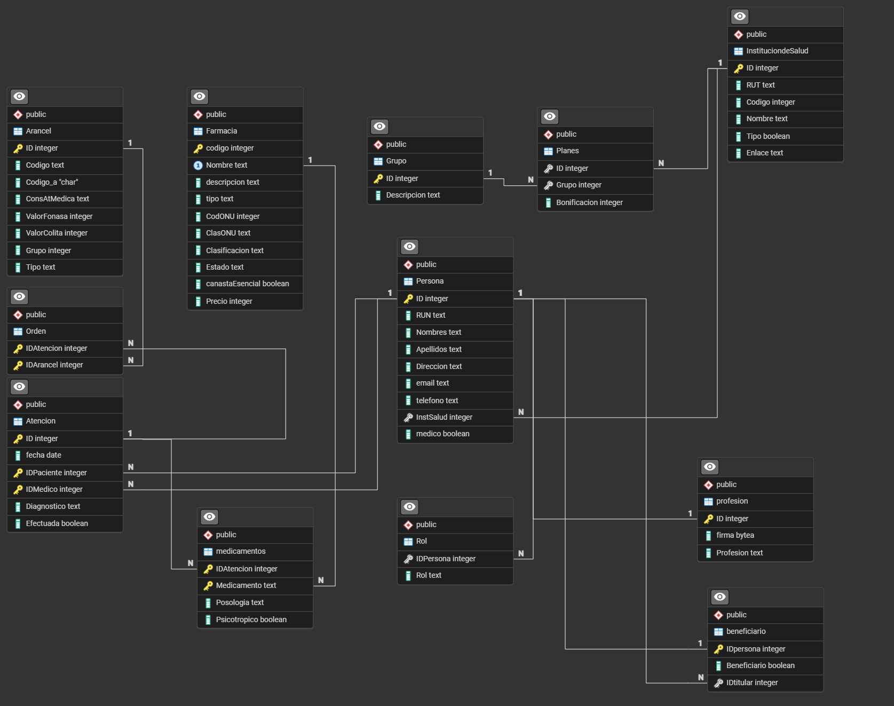
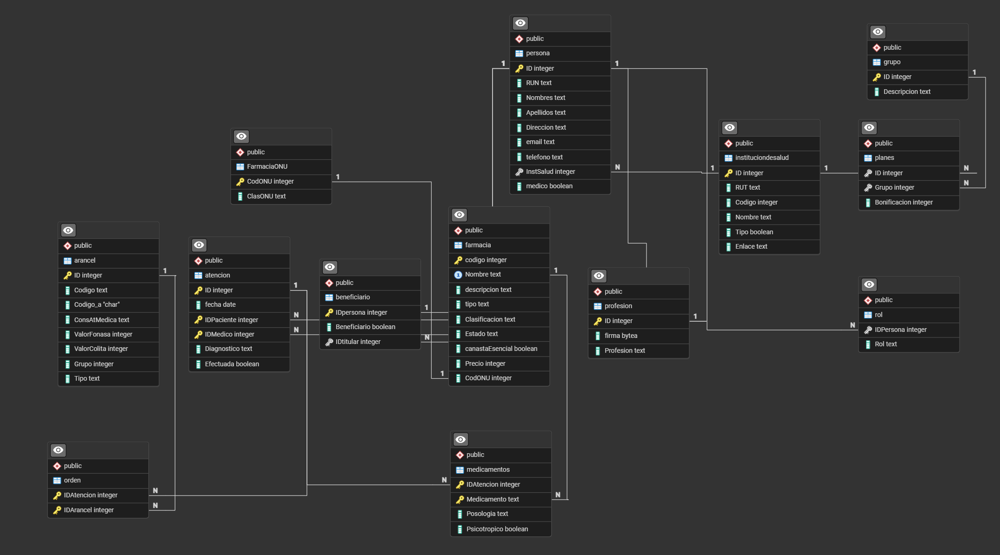

# Informe Entrega 3 - Bases de datos IIC2413

### Datos del Alumno
| **Apellidos**       | **Nombres**          | **Número de Alumno** |
|---------------------|----------------------|----------------------|
| Jara García         | Fernando Martín      | 2420286J             |

### 1. Esquema Relacional
El esquema relacional de la **ENTREGA PASDADA es:**

#### Restaurar BCNF
Esta versión del esquema tiene una sección que rompe con 3NF;
1. Farmacia (CodONU -> ClasONU rome 3NF)
Para Transformar el esquema a BCNF, debemos quitar CodOnu y ClasONU de la tabla farmacia y crear una nueva tabla que guarde este valor, de la forma:
-- FarmaciaONU(CodONU SERIAL PK, ClasONU VARCHAR NOT NULL) --
2. Dentro de los csvs, hay parametros que no cumplen la primera forma normal, entre ellos el rol de persona, es decir, si es paciente, staff o admin.

#### Homologar Atributos y Restricciones de Integridad
Por otro lado, los archivos excel tienen distintos nobmres para los atributos de la entrega pasada, además hay restricciones de integridad que cambia (por ejemplo, en el esquema E2 hay parametros que son BOOL que en los csv son INT). Para esto, actualizaremos las siguientes tablas:
- Persona()

### 2. Revisión PHP
Para hacer la revisión de formato de atributos (correos, run, rut, etc), revisión superficial de restricciones de integridad, eliminación de tuplas duplicadas y revisar/corregir datos estandarizados (como persona que puede ser paciente, Staff, admin o una combinación) se crearon los siguientes módulos de php, enfocados en el orden y pep8.

1. parametros.php -> Módulo donde se definen variables que serán meros parametros: por ejemplo las rutas de los archivos o dominios de los attributos.
2. utilidades.php -> Módulo que contiene las funciones importantes para hacer la limpeiza de los archivos. Las funciones están **parametrizadas** y **estandarizadas**, es decir, son compatibles con todos los archivos csv y se adaptan a cada uno.
3. reparaciones.php -> modulo que tiene las funciones para reparar/corregir attr de tuplas.
4. main.php -> Archivo principal que incorpora utilidades y parametros para hacer la limpieza. Aquí se llama a las funciones para crear los log y csvs nuevos.

### Bibliografía:
Observación: Las fuentes se usaron para entender como funcionan ciertos comandos de php, en ningún momento para copiar código y pegarlo, de ningún tipo o manera.
1. Para los códigos se reusó las funciones/lienas propuestas de php en las ayudantías 8 y 9. Esto incluye la funcipon de lectura, escritura y elminiación de duplicados de archivos, entre otras.
2. Se usa para concatenar strings https://www.w3schools.com/php/php_string_concatenate.asp 
3. Explode para hacer los splits de python en strings. https://www.php.net/explode 
4. filexists para revisar si los csv existen y usarlo como condicino en utilidades.php https://www.php.net/manual/en/function.file-exists.php 
5. Como no hay diccionarios, tuve que usar arrays 'dirigidos' https://stackoverflow.com/questions/6490482/are-there-dictionaries-in-php 
6. Para poder iterar las listas y acceder a los indices https://stackoverflow.com/questions/141108/how-to-find-the-foreach-index 
7. Resulta que en php las variablesd eclaradas globalmente (parametros.php) no las lee localmente las funciones, asi que tuve que usar global https://forum.exercism.org/t/global-variables-declared-outside-the-expected-solution-functions-are-not-recognized/9750/8
8. Para revisar números en restriccciones de integridad https://www.php.net/manual/en/function.is-numeric.php
9. Para la revisión de ruts, str_contains() https://www.php.net/manual/en/function.str-contains.php