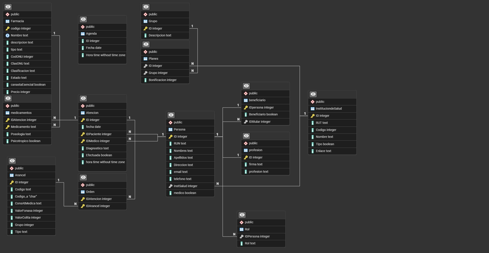

# Informe Entrega 4 - Bases de datos IIC2413

### Datos del Alumno
| **Apellidos**       | **Nombres**          | **Número de Alumno** |
|---------------------|----------------------|----------------------|
| Jara García         | Fernando Martín      | 2420286J             |

### 0. Esquema de la base

### 1. Descripción de la solución 
<!-- El análisis de la solución, describe aquí qué y como usaste  HTML, CSS, PHP, SQL, PSQL. 
Cómo rescatas los datos de la base para desplegarlo en los formularios hy viceversa-->
#### Parte 1.a)
Debemos generar un índice sobre todas las tablas y consultas que utilizen **RUN**. Notamos que este atributo está contenido unicamente en la tabla Persona, por lo que solo generamos el indice ahí.
#### Parte 1.b)
Tras una breve Query en Agenda, notamos que su llave primaria es sus tres atributos juntos (ID, Fecha, Hora), por lo que para crear un indice en su PK, debemos crear un índice sobre los tres atributos.

Adicionalmente, definimos (ID, Fecha, Hora) como llave primaria de la tabla Agenda.

#### Parte 1.c)
Dado que en la pregunta 1 no se ingresa, modifica o eliminan datos de la base, no se agregan transacciones entre la pregunta 1.a hasta la 1.g. Sin embargo, para la pregunta 2 en adelante, se agregarán transacciones para asegurar que no ocurran los problemas discutidos en la I2 (Asegurar ACID y prevenir problemas de lecturas sucias/no repetibles y sobreescrituras).

#### Parte 1.d) 
Para generar los tres tipos de documentos asociados a una atención, se crea una función para cada tipo de documento. Por último, se crea una cuarta función que llama las tres funciones anteriores y retorna todas las recetas de una atención.

#### Parte 1.e)
Tras detecetar que una atención ha sido efectuada y se ha ingresado diagnóstico/recetas/ordenes, se gatilla el trigger creado para esta seccion que llama la función de 1.d.

Esta parte fue complicada y cree dos funciones y tres vistas auxiliares que permiten asegurar el funcionamiento correcto del trigger.

#### Parte 1.f)
Para crear la vista, simplemente creé la query aosciada y agregué el CREATE VIEW Ficha AS (...). También, para agregar las especialidades desde el csv, desde el pgadmin usé la opcion de importar data directamente desde el csv. Para esto, dropee la tabla profesiones y la cree denuevo.

#### Parte 1.g)
Para validar los ingresos de datos a la base -tanto en formato como en contenido- se crean triggers específicos para revisar ambos casos.

### 2. Referencias a documentación externa válida
<!-- Registra aquí fuentes externas de información utilizada (manuales, videos, etc. -->
#### Para la pregunta 1:
1. Para agregarle la PK a la tabla Agenda, usando constraint, se consulto: https://www.w3schools.com/sql/sql_primarykey.ASP 
Para la generación de recetas se consultó:
1. Mi consulta entregada en la E2
2. https://www.geeksforgeeks.org/sql-server/how-to-use-string_agg-to-concatenate-strings-in-sql-server Para usar string_agg
3. https://stackoverflow.com/questions/36028908/postgresql-newline-character Para hacer los newlines (Me costó harto encontrar uno que funcionara)

Para los StoredProcedure/Functions de la emisión de recetas se consultó:
1. https://www.w3schools.com/sql/func_sqlserver_coalesce.asp COALESCE util como siempre para manejar los nulls en la consulta de recetas (hay muchas consultas que no tienen receta psicotropica y al ser null rompian la consulta).

Para agregar el rigger de 1.e, tuve que consultar:
1. https://stackoverflow.com/questions/42920998/pl-pgsql-perform-vs-execute porque no me estaba funcionando el llamado de las funciones en el trigger y funciones. No sabía que se hacian de distinta forma (perform/execute) según el caso.

En general, volví a usar mis códigos de la E2.

#### Para la pregunta 2. 

### 3. Instrucciones de ejecución de Entrega
<!-- Indica las instrucciones para ejecutar la aplicación web adicionales al URL -->

### 4. Observaciones adicionales